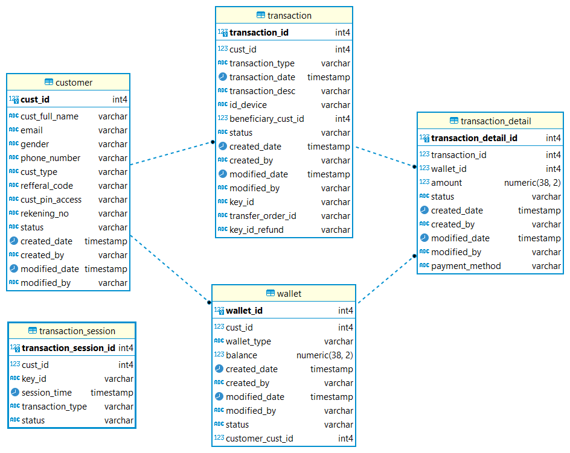
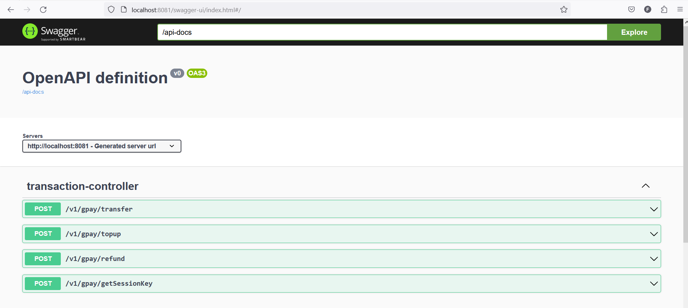

# Read Me First
<h2>Tech Stack In Project</h2>
- Java version 17
- Spring Boot 3.1.4
- Maven 3.8.7
- Postgres SQL
- Swagger-UI
- Spring Data Jpa
- Hibernate

<h2>List Service</h2>
http://localhost:8081/v1/gpay/getSessionKey?custId=?&trxType=?
http://localhost:8081/v1/gpay/refund
http://localhost:8081/v1/gpay/transfer
http://localhost:8081/v1/gpay/topup

<h2>Intallation And Run</h2>
- Pastikan Config Database di application.properties sesuai , di dalam project ini menggunakan user database "postgres"
- alter script_init.sql. Note : schema database disesuaikan setiingan lokal
- terdapat customer & wallet default yaitu custId:1 & custId:2 script insert ada di script_init.sql
- port yang di gunakan 8081 
- Root endpoint http://localhost:8081/
- build projcet : mvn clean install
- run project : mvn spring-boot:run
- link documentation swagger : http://localhost:8081/swagger-ui/index.html#

<h2>Use Service</h2>
- Setiap service transaction menggunakan "keyId" yang di dapat di service /v1/gpay/getSessionKey?custId=?&trxType=?
- keyId sebagai tanda claim transaksi di setiap session, setiap transaksi mempunyai trxType berbeda

<h2>Database Design</h2>
 

 

<h2>Swagger</h2>
 

 
